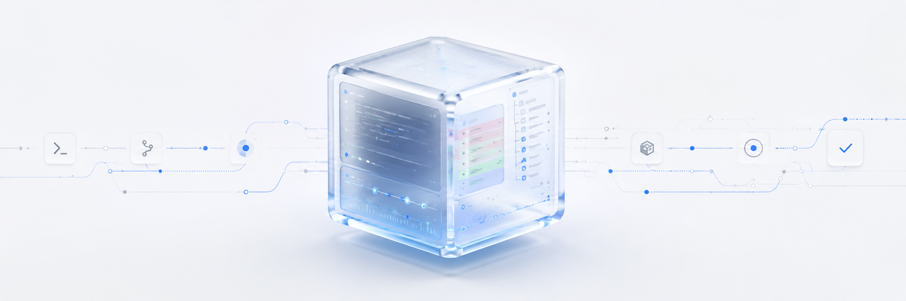

<h1 align="center">Runtrace</h1>

<p align="center">
  <strong>A black box for AI coding agents.</strong>
</p>

<p align="center">
  Run any coding agent through Runtrace and get a clean local report: command output, git diff, changed files, and review checklist.
</p>

<p align="center">
  
</p>

<p align="center">
  
  
  
  
</p>

## Try it in 30 seconds

```bash
git clone https://github.com/husi0x/runtrace.git
cd runtrace
python -m venv .venv
source .venv/bin/activate
pip install .
runtrace demo
```

Runtrace prints the report paths after `demo`:

```bash
xdg-open .runtrace/runs/<printed-run-id>/report.html
```

## Why Runtrace?

AI coding agents can change 20 files in one run. Runtrace shows what they actually did.

Each run creates a local folder under `.runtrace/runs/<run_id>/` with:

```text
metadata.json    # machine-readable run record
output.log       # full command output
report.md        # readable Markdown report
report.html      # self-contained HTML report
```

Runtrace records command timing, exit code, live output, git branch/commit/status/diff when available, changed files, and deterministic review findings.

If the directory is not a git repository, Runtrace still records command output and marks git tracking as unavailable.

## Example workflows

Use it with Codex:

```bash
runtrace run --name "codex bugfix" -- codex exec "fix the failing tests"
runtrace report
runtrace show latest
```

Use it with tests:

```bash
runtrace run --name "pytest baseline" -- pytest -q
runtrace report
```

Use portable subprocess mode when you do not want best-effort PTY handling:

```bash
runtrace run --no-pty --name "tests" -- pytest -q
```

## CLI commands

| Command | What it does |
|---|---|
| `runtrace init` | Creates `.runtrace/config.toml` for custom review checks |
| `runtrace demo` | Records a safe demo run and generates reports |
| `runtrace run -- <command>` | Records any command |
| `runtrace run --no-pty -- <command>` | Records a command with portable subprocess mode |
| `runtrace report` | Generates Markdown and HTML reports |
| `runtrace index` | Generates `.runtrace/index.html` for all runs |
| `runtrace dashboard` | Alias for `runtrace index` |
| `runtrace export` | Prints a compact JSON summary for the latest run |
| `runtrace export --output summary.json` | Writes the JSON summary to a file |
| `runtrace list` | Lists previous runs |
| `runtrace runs` | Alias for `runtrace list` |
| `runtrace show <run_id>` | Shows one run in the terminal |
| `runtrace show latest` | Shows the newest run |
| `runtrace latest` | Shortcut for `runtrace show latest` |
| `runtrace clean --keep 20` | Deletes old runs, keeping the newest 20 |
| `runtrace version` | Prints the installed version |

See [docs/CLI.md](docs/CLI.md) for full command details and common mistakes.

## Reports

Runtrace generates local Markdown, HTML, index, and JSON summary artifacts:

```bash
runtrace report
runtrace index
runtrace export --output summary.json
```

The full command output stays in `output.log`. The full machine-readable run record stays in `metadata.json`. The JSON export intentionally skips huge logs and full diffs.

Sample output is included in [examples/sample-output](examples/sample-output/). See [docs/REPORTS.md](docs/REPORTS.md) for details.

## Configuration

Create local review rules:

```bash
runtrace init
```

Then edit `.runtrace/config.toml` to change sensitive path patterns, dependency/config patterns, test command patterns, or the large-diff threshold.

See [docs/CONFIG.md](docs/CONFIG.md).

## Privacy

Runtrace does not call any external API. Everything is stored locally in `.runtrace/`.

Reports may include command output, file paths, and git diffs. Review them before sharing publicly.

See [SECURITY.md](SECURITY.md) for practical security notes.

## Verify locally

```bash
bash scripts/smoke.sh
```

## Install with pipx from GitHub

```bash
pipx install git+https://github.com/husi0x/runtrace.git
runtrace demo
```

PyPI release prep is documented in [docs/PYPI.md](docs/PYPI.md). Publishing is manual.

## Docs

- [CLI reference](docs/CLI.md)
- [Reports and privacy](docs/REPORTS.md)
- [Configuration](docs/CONFIG.md)
- [PyPI release prep](docs/PYPI.md)
- [Release checklist](docs/RELEASE.md)
- [GitHub metadata](docs/GITHUB.md)
- [Examples](examples/README.md)
- [Contributing](CONTRIBUTING.md)
- [Security](SECURITY.md)
- [Changelog](CHANGELOG.md)
- [License](LICENSE)

## License

MIT — see [LICENSE](LICENSE).
